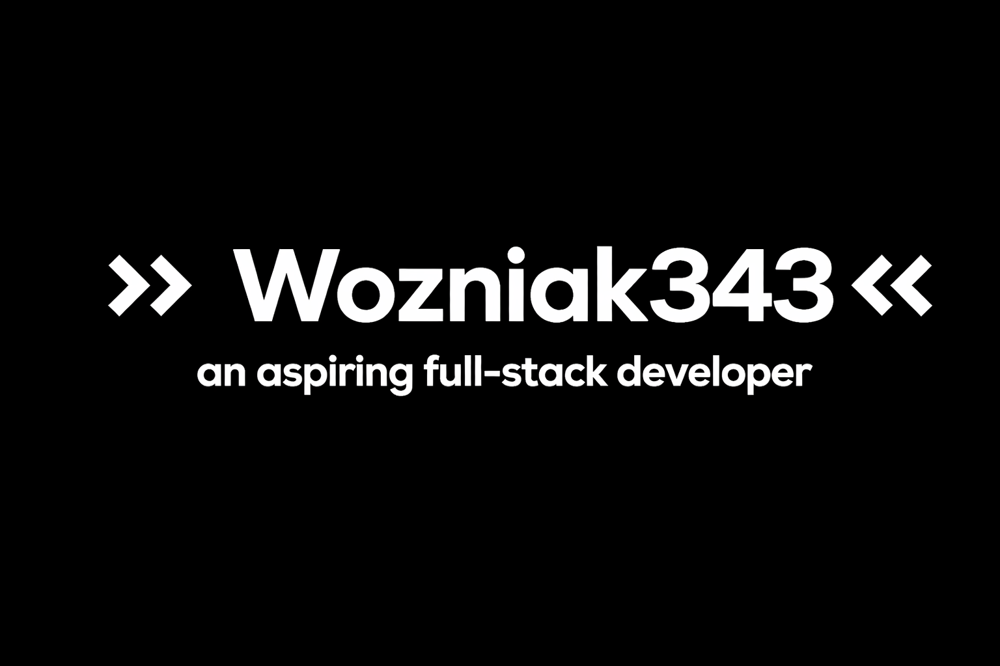

<h2> / about me /</h2>

- 🎓 Systems Engineer
- 🔭 currently working on <strong>Personal projects</strong> Owo
- 🌱 currently learning <strong>AI development</strong>
- 🤝 open to learning, building, and collaborating on useful projects

I am a Systems Engineer, having graduated with a strong commitment to academic and technical excellence. My professional focus lives at the intersection of hardware infrastructure, software optimisation and process automation.

I consider myself an efficiency enthusiast. I am not only interested in ensuring that the code works, but also that the entire system — from the operating system kernel to the end-user interface — runs with clarity, harmony and precision. This attention to detail comes from a deep curiosity about system architecture and a personal appreciation for linguistic precision and high-quality technical documentation.

   
  

  
<h2> / current skills / </h2>
  
- <h4> languages </h4>
  
  
  
  
  
  
  
  
  
  
  
  
  
  
  
  
  

- <h4> databases </h4>
  
  
  
  
  
  
  
  
  
  
  
- <h4> currently learning </h4>
  
  
  
  
  
  
  
- <h4> frameworks & libraries </h4>
  
  
  
  
- <h4> Info UwO </h4>
  
  
  
  
  
    
  

  <h2><strong> / Contact Me / </strong></h2>
  
<strong>Let's build something awesome together</strong>

  
  &nbsp;&nbsp;&nbsp;
  
  &nbsp;&nbsp;&nbsp;
  

  

  <h2> / contribution activity / </h2>
  <a href="https://next.ossinsight.io/widgets/official/analyze-user-contribution-time-distribution?period=all_times&user_id=134720616" target="_blank" rel="noreferrer">
    <picture>
      <source media="(prefers-color-scheme: dark)" srcset="https://next.ossinsight.io/widgets/official/analyze-user-contribution-time-distribution/thumbnail.png?period=all_times&user_id=134720616&image_size=auto&color_scheme=dark" width="721" height="auto">
      
    </picture>
  </a>

  <h2> / GitHub dashboard / </h2>
  <a href="https://next.ossinsight.io/widgets/official/compose-user-dashboard-stats?user_id=134720616" target="_blank" rel="noreferrer">
    <picture>
      <source media="(prefers-color-scheme: dark)" srcset="https://next.ossinsight.io/widgets/official/compose-user-dashboard-stats/thumbnail.png?user_id=134720616&image_size=auto&color_scheme=dark" width="771" height="auto">
      
    </picture>
  </a>

  

------

Last Edited on: 6/04/2026